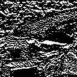
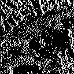
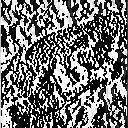
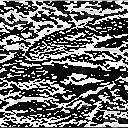
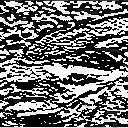
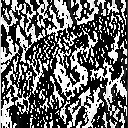

# Q.11 - 20

## Q.11. 平滑化フィルタ

平滑化フィルタ(3x3)を実装せよ。

平滑化フィルタはフィルタ内の画素の平均値を出力するフィルタである。

|入力画像 (imori.jpg)|出力画像 (answer_11.jpg)|
|---|---|
|||

答え >> answer_11.py


## Q.12. モーションフィルタ

モーションフィルタ(3x3)を実装せよ。

モーションフィルタとは対角方向の平均値を取るフィルタであり、次式で定義される。

```bash
  1/3  0   0
[  0  1/3  0 ]
   0   0  1/3
```

|入力画像 (imori.jpg)|出力画像 (answer_12.jpg)|
|---|---|
|||

答え >> answer_12.py

## Q.13. MAX-MINフィルタ

MAX-MIJフィルタ(3x3)を実装せよ。

MAX-MINフィルタとはフィルタ内の画素の最大値と最小値の差を出力するフィルタであり、**エッジ検出**のフィルタの一つである。
エッジ検出とは画像内の線を検出るすることであり、このような画像内の情報を抜き出す操作を**特徴抽出**と呼ぶ。
エッジ検出では多くの場合、グレースケール画像に対してフィルタリングを行う。

|入力画像 (imori.jpg)|出力画像 (answer_13.jpg)|
|---|---|
|||

答え >> answer_13.py


## Q.14. 微分フィルタ

微分フィルタ(3x3)を実装せよ。

微分フィルタは輝度の急激な変化が起こっている部分のエッジを取り出すフィルタであり、隣り合う画素同士の差を取る。

```bash
    (a)縦方向         (b)横方向
      0 -1 0            0 0 0
K = [ 0  1 0 ]   K = [ -1 1 0 ]
      0  0 0            0 0 0
```

|入力画像 (imori.jpg)|出力画像・縦方向 (answer_14_v.jpg)|出力画像・横方向 (answer_14_h.jpg)|
|---|---|---|
||||

答え >> answer_14.py

## Q.15. ソーベルフィルタ

ソーベルフィルタ(3x3)を実装せよ。

ソーベルフィルタは特定方向（縦や横）のエッジのみを抽出するフィルタであり、次式でそれぞれ定義される。

```bash
    (a)縦方向       (b)横方向
      1 0 -1           1  2  1
K = [ 2 0 -2 ]   K = [ 0  0  0 ]
      1 0 -1           -1 -2 -1
```

|入力画像 (imori.jpg)|出力画像・縦方向 (answer_15_v.jpg)|出力画像・横方向 (answer_15_h.jpg)|
|---|---|---|
||||

答え >> answer_15.py

## Q.16. Prewittフィルタ

Prewittフィルタ(3x3)を実装せよ。

Prewittフィルタはエッジ抽出フィルタの一種であり、次式で定義される。

```bash
    (a)縦方向          (b)横方向
      -1 -1 -1          -1 0 1
K = [  0  0  0 ]  K = [ -1 0 1 ]
       1  1  1          -1 0 1
```

|入力画像 (imori.jpg)|出力画像・縦方向 (answer_16_v.jpg)|出力画像・横方向 (answer_16_h.jpg)|
|---|---|---|
||||

答え >> answer_16.py
