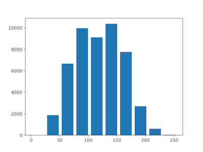
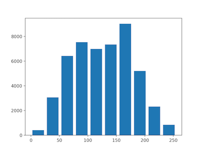

# Q.11 - 20

## Q.11. 平滑化フィルタ

平滑化フィルタ(3x3)を実装せよ。

平滑化フィルタはフィルタ内の画素の平均値を出力するフィルタである。

|入力画像 (imori.jpg)|出力画像 (answer_11.jpg)|
|---|---|
|||

答え >> answer_11.py


## Q.12. モーションフィルタ

モーションフィルタ(3x3)を実装せよ。

モーションフィルタとは対角方向の平均値を取るフィルタであり、次式で定義される。

```bash
  1/3  0   0
[  0  1/3  0 ]
   0   0  1/3
```

|入力画像 (imori.jpg)|出力画像 (answer_12.jpg)|
|---|---|
|||

答え >> answer_12.py

## Q.13. MAX-MINフィルタ

MAX-MIJフィルタ(3x3)を実装せよ。

MAX-MINフィルタとはフィルタ内の画素の最大値と最小値の差を出力するフィルタであり、**エッジ検出**のフィルタの一つである。
エッジ検出とは画像内の線を検出るすることであり、このような画像内の情報を抜き出す操作を**特徴抽出**と呼ぶ。
エッジ検出では多くの場合、グレースケール画像に対してフィルタリングを行う。

|入力画像 (imori.jpg)|出力画像 (answer_13.jpg)|
|---|---|
|||

答え >> answer_13.py


## Q.14. 微分フィルタ

微分フィルタ(3x3)を実装せよ。

微分フィルタは輝度の急激な変化が起こっている部分のエッジを取り出すフィルタであり、隣り合う画素同士の差を取る。

```bash
    (a)縦方向         (b)横方向
      0 -1 0            0 0 0
K = [ 0  1 0 ]   K = [ -1 1 0 ]
      0  0 0            0 0 0
```

|入力画像 (imori.jpg)|出力画像・縦方向 (answer_14_v.jpg)|出力画像・横方向 (answer_14_h.jpg)|
|---|---|---|
||||

答え >> answer_14.py

## Q.15. ソーベルフィルタ

ソーベルフィルタ(3x3)を実装せよ。

ソーベルフィルタは特定方向（縦や横）のエッジのみを抽出するフィルタであり、次式でそれぞれ定義される。

```bash
    (a)縦方向       (b)横方向
      1 0 -1           1  2  1
K = [ 2 0 -2 ]   K = [ 0  0  0 ]
      1 0 -1           -1 -2 -1
```

|入力画像 (imori.jpg)|出力画像・縦方向 (answer_15_v.jpg)|出力画像・横方向 (answer_15_h.jpg)|
|---|---|---|
||||

答え >> answer_15.py

## Q.16. Prewittフィルタ

Prewittフィルタ(3x3)を実装せよ。

Prewittフィルタはエッジ抽出フィルタの一種であり、次式で定義される。

```bash
    (a)縦方向          (b)横方向
      -1 -1 -1          -1 0 1
K = [  0  0  0 ]  K = [ -1 0 1 ]
       1  1  1          -1 0 1
```

|入力画像 (imori.jpg)|出力画像・縦方向 (answer_16_v.jpg)|出力画像・横方向 (answer_16_h.jpg)|
|---|---|---|
||||

答え >> answer_16.py

## Q.17. ヒストグラム表示

matplotlibを用いて*imori_dark.jpg*のヒストグラムを表示せよ。
また減色処理を行い、ヒストグラムを作成せよ。

ヒストグラムとは画素の出現回数をグラフにしたものである。
matplotlibではhist()という関数がすでにあるので、それを利用する。

|入力画像 (imori_dark.jpg)|出力画像 (answer_17_1.jpg) |出力画像(減色処理後)(answer_17_2.jpg)|
|---|---|---|
||||

答え >> answer_17.py

## Q.18. ヒストグラム正規化

ヒストグラム正規化を実装せよ。

ヒストグラムはQ.17であるように、偏りを持っていることが伺える。
例えば、0に近い画素が多ければ画像は全体的に暗く、255に近い画素が多ければ画像は明るくなる。
ヒストグラムが局所的に偏っていることを**ダイナミックレンジが狭い**などと表現する。
そのため画像を人の目に見やすくするために、ヒストグラムを正規化したり平坦化したりなどの処理が必要である。

このヒストグラム正規化は**濃度階調変換(glay-scale transformation)** と呼ばれ、[c,d]の画素値を持つ画像を[a,b]のレンジに変換する場合は次式で実現できる。
今回は*imori_dark.jpg*を[0, 255]のレンジにそれぞれ変換する。

```bash
xout = {  a                         (xin < c)
         (b-a)/(d-c) * (xin-c) + a  (c <= xin <= d)
          b                         (d < xin)
```

|入力画像 (imori_dark.jpg)|出力画像 (answer_18_1.jpg) |ヒストグラム(answer_18_2.jpg)|
|---|---|---|
||||

答え >> answer_18.py

## Q.19. ヒストグラム平坦化

ヒストグラム平坦化(平均値m0=128、標準偏差s0=52)を実装せよ。

ヒストグラム平坦化とはヒストグラムのダイナミックレンジを変更するのではなく、ヒストグラムを平坦に変更する操作である。

平均値m、標準偏差s、のヒストグラムを平均値m0, 標準偏差s0に変更するには、次式によって変換する。

```bash
xout = s0 / s * (xin - m) + m0
```

|入力画像 (imori.jpg)|出力画像 (answer_19_1.jpg) |ヒストグラム(answer_19_2.jpg)|
|---|---|---|
||||

答え >> answer_19.py

## Q.20. ガンマ補正

*imori_gamma.jpg*に対してガンマ補正(c=1, g=2.2)を実行せよ。

ガンマ補正とは、カメラなどの媒体の経由によって画素値が非線形的に変換された場合の補正である。
ディスプレイなどで画像をそのまま表示すると画面が暗くなってしまうため、RGBの値を予め大きくすることで、ディスプレイの特性を排除した画像表示を行うことがガンマ補正の目的である。

非線形変換は次式で起こるとされる。
ただしxは[0,1]に正規化されている。
c ... 定数、g ... ガンマ特性(通常は2.2)

```bash
x' = c * Iin ^ g
```

そこで、ガンマ補正は次式で行われる。

```bash
Iout = (1/c * Iin) ^ (1/g)
```

|||

|入力画像 (imori_gamma.jpg)|出力画像 (answer_20.jpg)|
|---|---|
|||

答え >> answer_20.py
