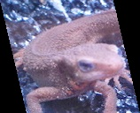

# Q. 31 - 40

## Q.31. アフィン変換(スキュー)

(1)アフィン変換を用いて、出力(1)のようなX-sharing(dx = 30)画像を作成せよ。

(2)アフィン変換を用いて、出力2のようなY-sharing(dy = 30)画像を作成せよ。

(3)アフィン変換を用いて、出力3のような幾何変換した(dx = 30, dy = 30)画像を作成せよ。

このような画像はスキュー画像と呼ばれ、画像を斜め方向に伸ばした画像である。

出力(1)の場合、x方向にdxだけ引き伸ばした画像はX-sharingと呼ばれる。

出力(2)の場合、y方向にdyだけ引き伸ばした画像はY-sharingと呼ばれる。

それぞれ次式のアフィン変換で実現できる。
ただし、元画像のサイズがh x wとする。

```bash
(1) X-sharing                  (2) Y-sharing
   a = dx / h                     a = dy / w

  x'       1 a tx    x           x'       1 0 tx    x
[ y' ] = [ 0 1 ty ][ y ]       [ y' ] = [ a 1 ty ][ y ]
  1        0 0  1    1           1        0 0  1    1
```

|入力 (imori.jpg)|出力 (1) (answer_31_1.jpg)|出力 (2) (answer_31_2.jpg)|出力 (3) (answer_31_3.jpg)|
|:---:|:---:|:---:|:---:|
|||||

答え >> answer_31.py

## Q.32. フーリエ変換

二次元離散フーリエ変換(u=[0,16], v=[0,16])を実装し、*imori.jpg*の周波数成分を表示せよ。

二次元離散フーリエ変換とはフーリエ変換の画像に対する処理方法である。

通常のフーリエ変換はアナログ信号や音声などは連続値かつ一次元であり、それらに対して周波数成分を求める計算処理である。一方、ディジタル画像は0~255の離散値をとり、かつ画像はHxWの二次元表示であるので、二次元離散フーリエ変換が行われる。

二次元離散フーリエ変換は次式で計算される。

```bash
X(u,v) = Sum_{h=0:H-1} Sum_{w=0:W-1} x(h,w) exp( -2pi j (uh/H + vx/X))
```
ここでは画像をグレースケール化してから二次元離散フーリエ変換を行え。

## Q.36. 離散コサイン変換

*imori.jpg*をグレースケール化し離散コサイン変換を行い、逆離散コサイン変換を行え。

離散コサイン変換(DCT: Discrete Cosine Transformation)とは、次式で定義される周波数変換の一つである。

```bash
T = 8
F(u,v) = 1 / T * C(u)C(v) * Sum_{y=0:T-1} Sum_{x=0:T-1} f(x,y) cos((2x+1)u*pi/2T) cos((2y+1)v*pi/2T)
```

逆離散コサイン変換(IDCT: Inverse Discrete Cosine Transformation)とは離散コサイン変換の逆（復号）であり、次式で定義される。

```bash
f(x,y) = 1 / T * C(x)C(y) * Sum_{u=0:T-1} Sum_{v=0:T-1} F(u,v) cos((2x+1)u*pi/2T) cos((2y+1)v*pi/2T)
```

ここでは画像を8x8ずつの領域に分割して、各領域で以上のDCT, IDCTを繰り返すことで、jpeg符号に応用される。
今回も同様に8x8の領域に分割して、DCT, IDCTを行え。

|入力 (imori.jpg)|グレースケール (imori_gray.jpg)|出力 (1) (answer_36.jpg)|
|:---:|:---:|:---:|
||||

答え >> answer_36.py

## Q.37. PSNR

IDCTで用いるDCT係数を8でなく、4にすると画像の劣化が生じる。
入力画像とIDCT画像のPSNRを求めよ。また、IDCTによるビットレートを求めよ。

PSNR(Peak Signal to Noise Ratio)とは信号対雑音比と呼ばれ、画像がどれだけ劣化したかを示す。

PSNRが大きいほど、画像が劣化していないことを示し、次式で定義される。
MAXは取りうる値の最大値で[0,255]の表示なら MAX=255　となる。
また、MSEはMean Squared Error(平均二乗誤差)と呼ばれ、二つの画像の差分の二乗の平均値を示す。


```bash
PSNR = 10 * log10(MAX^2 / MSE)
MSE = Sum_{y=0:H-1} Sum_{x=0:W-1} (I1(x,y) - I2(x,y))^2 / (HW)
```

ビットレートとは8x8でDCTを行い、IDCTでKxKの係数までを用いた時に次式で定義される。

```bash
bitrate = 8 * K^2 / 8^2
```

|入力 (imori.jpg)|グレースケール|出力 (answer_37.jpg) (PSNR = 27.62, Bitrate=2.0)|
|:---:|:---:|:---:|
||||

答え >> answer_37.py

## Q.38. DCT+量子化

DCT係数を量子化し、IDCTで復元せよ。また、その時の画像の容量を比べよ。

DCT係数を量子化することはjpeg画像にする符号化で用いられる手法である。

量子化とは、値を予め決定された区分毎に値を大まかに丸め込む作業であり、floorやceil, roundなどが似た計算である。

JPEG画像ではDCT係数を下記で表される量子化テーブルに則って量子化する。
この量子化テーブルはjpeg団体の仕様書から取った。
量子化では8x8の係数をQで割り、四捨五入する。その後Qを掛けることで行われる。
IDCTでは係数は全て用いるものとする。

```bash
Q = np.array(((16, 11, 10, 16, 24, 40, 51, 61),
              (12, 12, 14, 19, 26, 58, 60, 55),
              (14, 13, 16, 24, 40, 57, 69, 56),
              (14, 17, 22, 29, 51, 87, 80, 62),
              (18, 22, 37, 56, 68, 109, 103, 77),
              (24, 35, 55, 64, 81, 104, 113, 92),
              (49, 64, 78, 87, 103, 121, 120, 101),
              (72, 92, 95, 98, 112, 100, 103, 99)), dtype=np.float32)
```

量子化を行うと画像の容量が減っていることから、データ量が削減されたことが伺える。

|入力 (imori.jpg)|グレースケール(9kb)|出力 (answer_38.jpg) (7kb)|
|:---:|:---:|:---:|
||||

答え >> answer_38.py

## Q.39. YCbCr表色系

YCbCr表色形において、Yを0.7倍してコントラストを暗くせよ。

YCbCr表色系とは、画像を明るさを表すY、輝度と青レベルの差Cb、輝度と赤レベルの差Crに分解する表現方法である。

これはJPEG変換で用いられる。

RGBからYCbCrへの変換は次式。

```bash
Y = 0.299 * R + 0.5870 * G + 0.114 * B
Cb = -0.1687 * R - 0.3313 * G + 0.5 * B + 128
Cr = 0.5 * R - 0.4187 * G - 0.0813 * B + 128
```

YCbCrからRGBへの変換は次式。

```bash
R = Y + (Cr - 128) * 1.402
G = Y - (Cb - 128) * 0.3441 - (Cr - 128) * 0.7139
B = Y + (Cb - 128) * 1.7718
```

|入力 (imori.jpg)|出力 (answer_39.jpg) |
|:---:|:---:|
|||

答え >> answer_39.py

## Q.40. JPEG

YCbCr表色系にし、DCT後、Yを量子化テーブルQ1、CbとCrをQ2で量子化し、IDCTで画像を復元せよ。
また、画像の容量を比較せよ。

これはJPEGで実際に使われるデータ量削減の手法であり、Q1,Q2はJPEGの仕様書に則って次式で定義される。

```bash
Q1 = np.array(((16, 11, 10, 16, 24, 40, 51, 61),
               (12, 12, 14, 19, 26, 58, 60, 55),
               (14, 13, 16, 24, 40, 57, 69, 56),
               (14, 17, 22, 29, 51, 87, 80, 62),
               (18, 22, 37, 56, 68, 109, 103, 77),
               (24, 35, 55, 64, 81, 104, 113, 92),
               (49, 64, 78, 87, 103, 121, 120, 101),
               (72, 92, 95, 98, 112, 100, 103, 99)), dtype=np.float32)

Q2 = np.array(((17, 18, 24, 47, 99, 99, 99, 99),
               (18, 21, 26, 66, 99, 99, 99, 99),
               (24, 26, 56, 99, 99, 99, 99, 99),
               (47, 66, 99, 99, 99, 99, 99, 99),
               (99, 99, 99, 99, 99, 99, 99, 99),
               (99, 99, 99, 99, 99, 99, 99, 99),
               (99, 99, 99, 99, 99, 99, 99, 99),
               (99, 99, 99, 99, 99, 99, 99, 99)), dtype=np.float32)
```

|入力 (imori.jpg) (13kb)|出力 (answer_40.jpg) (8kb)|
|:---:|:---:|
|||

答え >> answer_40.py

