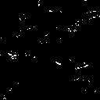
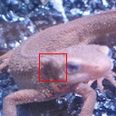

# Q. 51 - 60

## Q.51. モルフォロジー勾配

大津の二値化を行った後、モルフォロジー勾配を求めよ。

モルフォロジー勾配とはモルフォロジー膨張の画像と収縮の画像の差分をとることで、物体の境界線を抽出する手法である。

ここではモルフォロジー処理のN=1とする。

|入力 (imori.jpg) |出力(answer_51.jpg)|
|:---:|:---:|
|||

答え >> answer_51.py

## Q.52. トップハット変換

大津の二値化を行った後、トップハット変換を行え。

トップハット変換とは元画像からオープニング処理を行った画像を差し引いた画像であり、細い線状のものやノイズなどを抽出できると言われる。

ここでは、大津の二値化画像からオープニング処理画像(N=3)を差し引いて求めよ。

＊ここの問題だと効果が分かりにくいので、他の画像があればそのうち訂正します。

|入力 (imori.jpg) |大津の二値化(answer_4.jpg)|出力(answer_52.jpg)|
|:---:|:---:|:---:|
||||

答え >> answer_52.py

## Q.53. ブラックハット変換

大津の二値化を行った後、ブラックハット変換を行え。

ブラックハット変換とはクロージング画像から元画像を差し引いた画像であり、これもトップ変換同様に細い線状やノイズを抽出できると言われる。

ここでは、クロージング処理画像(N=3)から大津の二値化画像を差し引いて求めよ。

＊ここの問題だと効果が分かりにくいので、他の画像があればそのうち訂正します。

|入力 (imori.jpg) |大津の二値化(answer_4.jpg)|出力(answer_53.jpg)|
|:---:|:---:|:---:|
||||

答え >> answer_53.py

## Q.54. テンプレートマッチング SSD

ここではテンプレートマッチングのSSDを用いて、*imori_part.jpg*が*imori.jpg*のどこに位置するかを*imori.jpg*の赤の矩形で図示せよ。

テンプレートマッチングとは、テンプレート画像と全体画像の一部分で類似度が高い位置を探す手法であり、**物体検出**などで使われる。今では物体検出はCNNで行われるが、テンプレートマッチングは最も基本処理となる。

アルゴリズムとしては、画像I (H x W)、テンプレート画像T (h x w)とすると、

1. 画像Iにおいて、for ( j = 0, H-h)  for ( i = 0, W-w)と1ピクセルずつずらしながら画像Aの一部分I(i:i+w, j:j+h)とテンプレート画像の類似度Sを計算する。
2. Sが最大もしくは最小の位置がマッチング位置となる。

Sの選び方は主にSSD, SAD(Q.55), NCC(Q.56), ZNCC(Q.57)などがあり、それぞれ最大値をとるか最小値をとるか異なる。

ここではSSD(Sum of Squared Difference)を用いる。
SSDとは画素値の差分の二乗値の和を類似度にする手法であり、Sが**最小**の位置がマッチング位置となる。

```bash
S = Sum_{x=0:w, y=0:h} (I(i+x, j+y) - T(x, y) )^2
```

ちなみにテンプレートマッチングのように画像を左上から右に順に見ていくことを**走査**や**スライディングウィンドウ**と呼ぶ。このワードは画像処理でよく出る頻出である。

矩形の描画には*cv2.rectangle()*を用いると良い。
ちなみにimori_part.jpgは若干色味を変えています。

|入力 (imori.jpg) |テンプレート画像(imori_part.jpg)|出力(answer_54.jpg)|
|:---:|:---:|:---:|
||||

答え >> answer_54.py

## Q.55. テンプレートマッチング SAD

ここではテンプレートマッチングのSADを用いて、*imori_part.jpg*が*imori.jpg*のどこに位置するかを*imori.jpg*の赤の矩形で図示せよ。

SAD(Sum of Absolute Difference)とは画素値の差分の絶対値の和を類似度にする手法であり、Sが**最小**の位置がマッチング位置となる。

```bash
S = Sum_{x=0:w, y=0:h} |I(i+x, j+y) - T(x, y)|
```

|入力 (imori.jpg) |テンプレート画像(imori_part.jpg)|出力(answer_55.jpg)|
|:---:|:---:|:---:|
||||

答え >> answer_55.py

## Q.56. テンプレートマッチング NCC

ここではテンプレートマッチングのNCCを用いて、*imori_part.jpg*が*imori.jpg*のどこに位置するかを*imori.jpg*の赤の矩形で図示せよ。

NCC(Normalized Cross Correlation)とは正規化相互相関を類似度にする手法であり、Sが**最大**の位置がマッチング位置となる。

```bash
     Sum_{x=0:w, y=0:h} |I(i+x, j+y) T(x, y)|
S = -----------------------------------------------------------------------------
    Sqrt(Sum_{x=0:w, y=0:h} I(i+x, j+y)^2) * Sqrt(Sum_{x=0:w, y=0:h} T(x, y)^2)
```

このSは、-1<=S<=1をとる。
NCCは証明変化に強いと言われる。

|入力 (imori.jpg) |テンプレート画像(imori_part.jpg)|出力(answer_56.jpg)|
|:---:|:---:|:---:|
||||

答え >> answer_56.py

## Q.57. テンプレートマッチング ZNCC

ここではテンプレートマッチングのZNCCを用いて、*imori_part.jpg*が*imori.jpg*のどこに位置するかを*imori.jpg*の赤の矩形で図示せよ。

SZNCC(Zero means Normalized Cross Correlation)とは零平均正規化相互相関を類似度にする手法であり、Sが**最大**の位置がマッチング位置となる。

画像Iの平均値をmi、画像Tの平均値をmtとすると、Sは次式で計算される。

```bash
       Sum_{x=0:w, y=0:h} |(I(i+x, j+y)-mi) (T(x, y)-mt)|
S = --------------------------------------------------------------------------------------
    Sqrt(Sum_{x=0:w, y=0:h} (I(i+x, j+y)-mi)^2) * Sqrt(Sum_{x=0:w, y=0:h} (T(x, y)-mt)^2)
```

このSは、-1<=S<=1をとる。
ZNCCは平均値を引くことでNCCよりも証明変化に強いと言われる。（だが今回は検出が失敗する。）

|入力 (imori.jpg) |テンプレート画像(imori_part.jpg)|出力(answer_57.jpg)|
|:---:|:---:|:---:|
||||

答え >> answer_57.py

