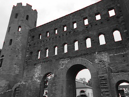
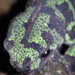
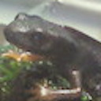

# 问题八十一至九十

## 问题八十一：Hessian角点检测

对`thorino.jpg`进行Hessian角点检测吧！

角点检测是检测边缘上的角点。

角点是曲率变大的点，下式定义了高斯曲率：
$$
K=\frac{\det(H)}{(1+{I_x}^2+{I_y}^2)^2}
$$

其中：

* $\det(H)=I_{xx}\ I_{yy}-{I_{xy}}^2$；
* $H$表示Hessian矩阵。图像的二次微分（通过将Sobel滤波器应用于灰度图像计算得来）。对于图像上的一点，按照下式定义：
  * $I_x$：应用$x$方向上的Sobel滤波器；
  * $I_y$：应用$y$方向上的Sobel滤波器；
  * $H=\left[\begin{matrix}{I_x}^2&I_xI_y\\I_xI_y&{I_y}^2\end{matrix}\right]$

Hessian角点检测中，将$\det(H)$中极大点视为焦点。极大点指的是，某一像素较其$8-$近邻像素，该像素的值是最大的。==解答ではdet(H)が極大点かつ、max(H)*0.1以上である点をコーナーとしている。==

| 输入 (thorino.jpg) | 输出(answers/answer_81.jpg) |
| :----------------: | :-------------------------: |
|    |   |

答案 >> [answers/answer_81.py](https://github.com/yoyoyo-yo/Gasyori100knock/blob/master/Question_81_90/answers/answer_81.py)

## 问题八十二：Harris 角点检测第一步：Sobel + Gausian

问题八十二和问题八十三对`thorino.jpg`进行 Harris 角点检测吧！

Harris 角点检测算法如下：

1. 对图像进行灰度化处理；

2. 利用Sobel滤波器求出海森矩阵（Hessian matrix）：
   $$
   H=\left[\begin{matrix}{I_x}^2&I_xI_y\\I_xI_y&{I_y}^2\end{matrix}\right]
   $$
3. Ix^2, Iy^2, IxIyにそれぞれガウシアンフィルターをかける。
4. 计算每个像素的 R = det(H) - k (trace(H))^2。通常K取 [0.04,0.16].
5. 满足 R >= max(R) * th  的像素点即为角点（th 多取 0.1）。

问题82至问题83中的参数如下：

* 高斯滤波器：(k=3, sigma=3)；
*  K = 0.04, th = 0.1。

在这里我们完成步骤1到步骤3。

| 输入 (thorino.jpg) | 输出(answers/answer_82.png) |
| :----------------: | :-------------------------: |
|    |   |

答案 >> [answers/answer_82.py](https://github.com/yoyoyo-yo/Gasyori100knock/blob/master/Question_81_90/answers/answer_82.py)

## 问题八十三：Harris 角点检测第二步：角点检测

在这里进行算法的步骤4​和步骤5​吧！

在步骤4​中，k = 0.04​；在步骤5​中th = 0.1​。

| 输入 (thorino.jpg) | 输出(answers/answer_83.jpg) |
| :----------------: | :-------------------------: |
|    |   |

答案 >> [answers/answer_83.py](https://github.com/yoyoyo-yo/Gasyori100knock/blob/master/Question_81_90/answers/answer_83.py)

## 问题八十四：简单图像识别第一步：减色化+直方图

这里我们进行简单的图像识别。

图像识别是识别图像中物体的类别（它属于哪个类）的任务。图像识别通常被称为Classification、Categorization、Clustering等。

一种常见的方法是通过 HOG、SIFT、SURF 等方法从图像中提取一些特征，并通过特征确定物体类别。这种方法在CNN普及之前广泛采用，但 CNN 可以完成从特征提取到分类等一系列任务。

这里，利用图像的颜色直方图来执行简单的图像识别。算法如下：

1. 将图像`train.jpg`进行减色处理（像问题6中那样，RGB 取4种值）。
2. 创建减色图像的直方图。直方图中，RGB 分别取四个值，但为了区分它们，B = [1,4],G = [5,8],R = [9,12],bin=12。请注意，我们还需要为每个图像保存相应的直方图。也就是说，需要将数据储存在`database = np.zeros((10(训练数据集数), 13(RGB + class), dtype=np.int)`中。
3. 将步骤2中计算得到的直方图记为 database。
4. 计算想要识别的图像`test@@@.jpg`与直方图之间的差，将差称作特征量。
5. 直方图的差异的总和是最小图像是预测的类别。换句话说，它被认为与近色图像属于同一类。
6. 認識したい画像とヒストグラムの差を計算して、特徴量とする。
7. ヒストグラムの差の合計で、最小となった画像が予測となるクラスである。つまり、色が近い画像と同じクラスになると考えられる。

在这里，实现步骤1至步骤3并可视化直方图。

训练数据集存放在文件夹`dataset`中，分为`trainakahara@@@.jpg`（类别1）和`trainmadara@@@.jpg`（类别2）两类，共计10张。`akahara`是红腹蝾螈（Cynops pyrrhogaster），`madara`是理纹欧螈（Triturus marmoratus）。

这种预先将特征量存储在数据库中的方法是第一代人工智能方法。这个想法是逻辑是，如果你预先记住整个模式，那么在识别的时候就没有问题。但是，这样做会消耗大量内存，这是一种有局限的方法。


|输出(answers/answer_84.png)|
|:---:|
||

答案 >> [answers/answer_84.py](https://github.com/yoyoyo-yo/Gasyori100knock/blob/master/Question_81_90/answers/answer_84.py)

```bash
被存储的直方图的内容
[[  172 12254  2983   975   485 11576  3395   928   387 10090  4845  1062  0]
[ 3627  7350  4420   987  1743  8438  4651  1552   848  9089  4979  1468  0]
[ 1646  6547  5807  2384  1715  8502  5233   934  1553  5270  7167  2394  0]
[  749 10142  5465    28  1431  7922  7001    30  1492  7819  7024    49  0]
[  927  4197  8581  2679   669  5689  7959  2067   506  3973  6387  5518  0]
[ 2821  6404  2540  4619  1625  7317  3019  4423   225  8635  1591  5933  1]
[ 5575  7831  1619  1359  4638  6777  3553  1416  4675  7964  2176  1569  1]
[ 4867  7523  3275   719  4457  6390  3049  2488  4328  7135  3377  1544  1]
[ 7881  6160  1992   351  7426  3967  4258   733  7359  4979  3322   724  1]
[ 5638  6580  3916   250  5041  4185  6286   872  5226  4930  5552   676  1]]
```

## 问题八十五：简单图像识别第二步：判别类别

在这里我们完成算法的4至5步。

请使用测试数据集`testakahara@@@.jpg`和`testmadara@@@.jpg`（共计4张）。请输出各个与各个图像直方图差别最小的（训练数据集的）文件名和预测类别。这种评价方法被称为最近邻法（Neareset Neighbour）。

答案如下：

```bash
test_akahara_1.jpg is similar >> train_akahara_3.jpg  Pred >> akahara
test_akahara_2.jpg is similar >> train_akahara_1.jpg  Pred >> akahara
test_madara_1.jpg is similar >> train_madara_2.jpg  Pred >> madara
test_madara_2.jpg is similar >> train_akahara_2.jpg  Pred >> akahara
```
答案 >> [answers/answer_85.py](https://github.com/yoyoyo-yo/Gasyori100knock/blob/master/Question_81_90/answers/answer_85.py)

## 问题八十六：简单图像识别第三步：评估

在这里对图像识别的结果做评估。

正确率（Accuracy, Precision）用来表示多大程度上分类正确，在图像识别任务上是一般性的评价指标。正确率通过下式计算。要はテストにおける得点率である。当得到的值有小数时，也可以用百分比表示。
$$
\text{Accuracy}=\frac{\text{被正确识别的图像个数}}{\text{图像总数}}
$$
按照上面的方法，求出问题85中的正确率吧！答案如下：

```bash
Accuracy >> 0.75 (3/4)
```
答案 >> [answers/answer_86.py](https://github.com/yoyoyo-yo/Gasyori100knock/blob/master/Question_81_90/answers/answer_86.py)

## 问题八十七：简单图像识别第四步：k-NN

问题85中虽然我们预测了颜色最接近的图像，但实际上和`testmadara2.jpg`最接近的是`trainakahara2.jpg`。

|       test_marada_2.jpg        |       train_akahara_2.jpg        |
| :----------------------------: | :------------------------------: |
|  |  |

如果比较这两个图像，它们绿色和黑色比例看起来差不多，因此整个图像颜色看起来相同。これは認識時のサンプルを一つにしたことによって、例外的な画像が選ばれてしまったためである。因此，训练数据集的特征不能很好地分离，并且有时包括偏离特征分布的样本。

为了避免这中情况发生，在这里我们选择颜色相近的三副图像，并通过投票来预测最后的类别，再计算正确率。

像这样选择具有相似特征的3​个学习数据的方法被称为 k-近邻算法（k-NN: k-Nearest Neighbor）。 问题85​中的NN 方法是 k = 1​ 的情况。

答案：

```bash
test_akahara_1.jpg is similar >> train_akahara_3.jpg, train_akahara_2.jpg, train_akahara_4.jpg, |Pred >> akahara
test_akahara_2.jpg is similar >> train_akahara_1.jpg, train_akahara_2.jpg, train_akahara_4.jpg, |Pred >> akahara
test_madara_1.jpg is similar >> train_madara_2.jpg, train_madara_4.jpg, train_madara_3.jpg, |Pred >> madara
test_madara_2.jpg is similar >> train_akahara_2.jpg, train_madara_3.jpg, train_madara_2.jpg, |Pred >> madara
Accuracy >> 1.0 (4/4)
```

答案 >> [answers/answer_87.py](https://github.com/yoyoyo-yo/Gasyori100knock/blob/master/Question_81_90/answers/answer_87.py)

## 问题八十八：k-平均聚类算法（k -means Clustering）第一步：生成质心

问题84至问题87的图像识别任务是需要预期输出的简单监督学习（supervised-training）中的一种简单情况。在这里我们通过不需要预期输出的无监督学习（unsupervised-training）来进行图像分类。

最简单的方法是 k-平均聚类算法（k -means Clustering）。

k-平均聚类算法在类别数已知时使用。在质心不断明确的过程中完成特征量的分类任务。

k-平均聚类算法如下：

1. 为每个数据随机分配类；
2. 计算每个类的重心；
3. 计算每个数据与重心之间的距离，将该数据分到重心距离最近的那一类；
4. 重复步骤2和步骤3直到没有数据的类别再改变为止。

在这里，以减色化和直方图作为特征量来执行以下的算法：

1. 对图像进行减色化处理，然后计算直方图，将其用作特征量；
2. 对每张图像随机分配类别0或类别1（在这里，类别数为2，以`np.random.seed (1)`作为随机种子生成器。当`np.random.random`小于`th`时，分配类别0；当`np.random.random`大于等于`th`时，分配类别1，在这里`th=0.5`）；
3. 分别计算类别0和类别1的特征量的质心（质心存储在`gs = np.zeros((Class, 12), dtype=np.float32)`中）；
4. 对于每个图像，计算特征量与质心之间的距离（在此取欧氏距离），并将图像指定为质心更接近的类别。
5. 重复步骤3和步骤4直到没有数据的类别再改变为止。

在这里，实现步骤1​至步骤3​吧（步骤4​和步骤5​的循环不用实现）！将图像`test@@@.jpg`进行聚类。

答案：

```bash
assigned label
[[ 1493  7892  4900  2099  1828  9127  4534   895  1554  6750  5406  2674 0]
[  242 10338  3628  2176   587 12212  2247  1338   434 10822  4506   622 1]
[ 6421  5478   719  3766  5482  4294  2537  4071  5609  4823  2051  3901 0]
[ 3343  8134  4756   151  3787  7588  3935  1074  3595  8444  4069   276 0]]
Grabity
[[ 3752.3333  7168.      3458.3333  2005.3334  3699.      7003.
3668.6667  2013.3334  3586.      6672.3335  3842.      2283.6667]
[  242.     10338.      3628.      2176.       587.     12212.
2247.      1338.       434.     10822.      4506.       622.    ]]
```

答案 >> [answers/answer_88.py](https://github.com/yoyoyo-yo/Gasyori100knock/blob/master/Question_81_90/answers/answer_88.py)

## 问题八十九：k-平均聚类算法（k -means Clustering）第二步：聚类（Clustering）

在这里完成算法的步骤4和步骤5，进行聚类吧！

在这里预测类别为0和1，但顺序与问题85​至87​不同。

因此，k-平均聚类算法是一种完全按范围划分类别的方法。一条数据最后被划分到什么类别只有到最后才清楚。此外，必须预先知道类别的数量。

需要注意的是，k-平均聚类算法最初分配的类别对最后的结果有很大的影响。并且，数据量小的情况下极有可能失败。也就是说，数据量越大最后得到的数据分布越准确。

答案：

```bash
test_akahara_1.jpg  Pred: 0
test_akahara_2.jpg  Pred: 1
test_madara_1.jpg  Pred: 0
test_madara_2.jpg  Pred: 0
```

答案 >> [answers/answer_89.py](https://github.com/yoyoyo-yo/Gasyori100knock/blob/master/Question_81_90/answers/answer_89.py)

## 问题九十：k-平均聚类算法（k -means Clustering）第三步：调整初期类别

使用k-平均聚类算法将8张`train@@@.jpg`完美地聚类吧！

在这里，通过变更`np.random.seed()`的值和`np.random.random() < th`中分割类别的阈值`th`来更好地预测图片的类别吧！由于`train@@@.jpg`的图像数量是问题89​的两倍，因此可以更容易地聚类。

这只能通过反复试验来完成。

答案：

```bash
train_akahara_1.jpg  Pred: 1
train_akahara_2.jpg  Pred: 1
train_akahara_3.jpg  Pred: 1
train_akahara_4.jpg  Pred: 1
train_akahara_5.jpg  Pred: 1
train_madara_1.jpg  Pred: 0
train_madara_2.jpg  Pred: 0
train_madara_3.jpg  Pred: 0
train_madara_4.jpg  Pred: 0
train_madara_5.jpg  Pred: 0
```

答案 >> [answers/answer_90.py](https://github.com/yoyoyo-yo/Gasyori100knock/blob/master/Question_81_90/answers/answer_90.py)
