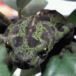
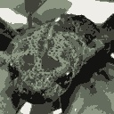

# Q. 91 - 100

## Q.91. K-meansによる減色処理 (Step.1) 色の距離によるクラス分類

*imori.jpg*をK-meansを用いた減色処理せよ。

減色処理はQ.6でも扱ったが、Q.6では予め決めた色に減色した。ここで扱うのはK-meansを用いて動的に減色する色を決定する。

アルゴリズムは,
1. 画像からランダムにK個のRGB成分をサンプリングする。（これをクラスと呼ぶことにする。）
2. 画像のそれぞれの画素に対して色の距離が最小となるクラスのインデックスを割り振る。

```bash
色の距離 dis = sqrt( (R-R')^2 + (G-G')^2 + (B-B')^2)
```
3. 各インデックスに対応する色成分の平均をRGBそれぞれに対して取り、新たなクラスとする。
4. 元のクラスと新しいクラスが全く同じならK-meansを終了する。そうでなければ、新しいクラスを元クラスとして2-3を繰り返す。
5. 元画像の各画素で色の距離が最小となるクラスのRGBを割り当てる。

ここでは1-2を実装せよ。
- クラス数はk=5とする
- ここでは画像をreshape((HxW, 3))にreshapeすると扱いやすくなる。
- 1においてはnp.random.seed(0)として、np.random.choice(np.arrange(画像のWxH), 5, replace=False)
- まずは3-5のループを考えずに実装せよ


```bash
# 最初に選べれた色
[[140. 121. 148.]
 [135. 109. 122.]
 [211. 189. 213.]
 [135.  86.  84.]
 [118.  99.  96.]]
```

最初に選ばれた色との色の距離でクラスのインデックスをつけたもの(アルゴリズム2)。
解答では0-4にインデックスの値をx50にして見やすいようにしている。

|入力 (imori.jpg) |出力(answer_91.jpg)|
|:---:|:---:|
|||

答え >> answer_91.py

## Q.92. K-meansによる減色処理 (Step.2) 減色処理

ここではアルゴリズム3-5も実装せよ。

```bash
# 選ばれた色
[[182.86730957 156.13246155 180.24510193]
 [156.75152588 123.88993835 137.39085388]
 [227.31060791 199.93135071 209.36465454]
 [ 91.9105835   57.94448471  58.26378632]
 [121.8759613   88.4736557   96.99688721]]
```

減色処理したもの。塗り絵イラスト風な画像にできる。k=10にすればある程度の色を保持しながらもイラスト風に減色できる。

また、k=5にして*madara.jpg*にも試してみよ。

|入力 (imori.jpg) | 出力(answer_92.jpg) | k=10(answer_92_k10.jpg) |入力2 (madara.jpg) |出力(answer_92_m.jpg) |
|:---:|:---:|:---:|:---:|:---:|
||||||

答え >> answer_92.py
