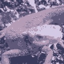
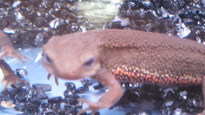
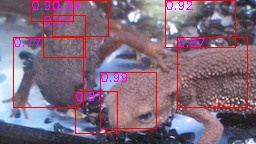
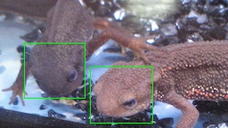

# Q. 91 - 100

## Q.91. 利用 k-平均聚类算法进行减色处理第一步----按颜色距离分类

对`imori.jpg`利用 k-平均聚类算法进行减色处理。

在问题6中涉及到了减色处理，但是问题6中事先确定了要减少的颜色。这里，k-平均聚类算法用于动态确定要减少的颜色。

算法如下：

1. 从图像中随机选取 K 个 RGB 分量（这我们称作类别）。
2. 将图像中的像素分别分到颜色距离最短的那个类别的索引中去，色彩距离按照下面的方法计算：

```bash
色の距離 dis = sqrt( (R-R')^2 + (G-G')^2 + (B-B')^2)
```
3. 计算各个索引下像素的颜色的平均值，这个平均值成为新的类别；
4. 如果原来的类别和新的类别完全一样的话，算法结束。如果不一样的话，重复步骤2和步骤3；
5. 将原图像的各个像素分配到色彩距离最小的那个类别中去。

在这里完成步骤1和步骤2。
- 类别数K=5；
- 在这里使用`reshape((HW, 3))`来改变图像大小之后图像将更容易处理；
- 步骤1中，对于`np.random.seed(0)`，使用`np.random.choice(np.arrange(图像的HW), 5, replace=False)`；
- 现在先不考虑步骤3到步骤5的循环。


```bash
# 最初选择的颜色
[[140. 121. 148.]
 [135. 109. 122.]
 [211. 189. 213.]
 [135.  86.  84.]
 [118.  99.  96.]]
```

最初に選ばれた色との色の距離でクラスのインデックスをつけたもの(アルゴリズム2)。
解答では0-4にインデックスの値をx50にして見やすいようにしている。

| 输入 (imori.jpg) | 输出(answers/answer_91.jpg) |
| :--------------: | :-------------------------: |
|    |   |

答案 >> [answers/answer_91.py](https://github.com/yoyoyo-yo/Gasyori100knock/blob/master/Question_91_100/answers/answer_91.py)

## Q.92. 利用 k-平均聚类算法进行减色处理第二步----减色处理

在这里实现算法的第3到5步。

```bash
# 选择的颜色
[[182.86730957 156.13246155 180.24510193]
 [156.75152588 123.88993835 137.39085388]
 [227.31060791 199.93135071 209.36465454]
 [ 91.9105835   57.94448471  58.26378632]
 [121.8759613   88.4736557   96.99688721]]
```

减色处理可以将图像处理成手绘风格。如果k=10，则可以在保持一些颜色的同时将图片处理成手绘风格。

现在，k=5的情况下试着将`madara.jpg`进行减色处理。

| 输入 (imori.jpg) | 输出(answers/answer_92.jpg) | k=10(answers/answer_92_k10.jpg) | 输入2 (madara.jpg) | 输出(answers/answer_92_m.jpg) |
| :--------------: | :-------------------------: | :-----------------------------: | :----------------: | :---------------------------: |
|    |   |   |     |   |

答案 >> [answers/answer_92.py](https://github.com/yoyoyo-yo/Gasyori100knock/blob/master/Question_91_100/answers/answer_92.py)


## Q.93. 准备机器学习的训练数据第一步----计算 IoU

从这里开始我们准备机器学习用的训练数据。

最终，我想创建一个能够判断图像是否是蝾螈的脸的判别器。为此，我们需要蝾螈的脸部图像和非蝾螈脸部的图像是。それらを用意するためのprogramを作成する。

为此，有必要从单个图像中用矩形框出蝾螈头部（即 Ground-truth），如果随机切割的矩形与 Ground-truth在一定程度上重合，那么这个矩形框处就是蝾螈的头。

重合程度通过检测评价函数（Intersection over Union）来判断。通过下式进行计算：

```bash
R1...Ground-truth的范围 , R2...随机框出来的矩形 , Rol...为R1和R2重合的范围
IoU = |Rol| / |R1 + R2 - Rol|
```

在这里计算以下两个矩形的 IoU 吧！

```python
# [x1, y1, x2, y2] x1,y1...矩形の左上のx,y  x2,y2...矩形の右下のx,y
a = np.array((50, 50, 150, 150), dtype=np.float32)

b = np.array((60, 60, 170, 160), dtype=np.float32)
```

答案

```bash
0.627907
```
答案 >> [answers/answer_93.py](https://github.com/yoyoyo-yo/Gasyori100knock/blob/master/Question_91_100/answers/answer_93.py)

## Q.94. 准备机器学习的训练数据第二步----随机裁剪（Random Cropping）

下面，通过从`imori1.jpg`中随机裁剪图像制作训练数据。

这里，从图像中随机切出200个60 x 60的矩形。

并且，满足下面的条件：

1. 使用`np.random.seed(0)`，求出裁剪的矩形的左上角座标`x1 = np.random.randint(W-60)`和`y1=np.random.randint(H-60)`；
2. 如果和 Ground-truth （`gt = np.array((47, 41, 129, 103), dtype=np.float32)`）的 IoU 大于 0.5，那么就打上标注 1，小于 0.5 就打上标注 0。

答案中，标注 1 的矩形用红色画出，标注 0 的矩形用蓝色的线画出，Ground-truth 用绿色的线画出。在这里我们简单地准备蝾螈头部和头部以外的图像。

| 输入 (imori_1.jpg) | 输出(answers/answer_94.jpg) |
| :----------------: | :-------------------------: |
|    |   |

答案 >> [answers/answer_94.py](https://github.com/yoyoyo-yo/Gasyori100knock/blob/master/Question_91_100/answers/answer_94.py)

## Q.95. 神经网络（Neural Network）第一步----深度学习（Deep Learning）

在这里将神经网络作为分类器，这就是现在流行的深度学习。

下面的代码是包含输入层、中间层（Unit 数：64）、输出层（1）的网络。这是实现异或逻辑的网络。网络代码参照了[这里](https://towardsdatascience.com/how-to-build-your-own-neural-network-from-scratch-in-python-68998a08e4f6)：

```python
import numpy as np

np.random.seed(0)

class NN:
    def __init__(self, ind=2, w=64, outd=1, lr=0.1):
        self.w1 = np.random.normal(0, 1, [ind, w])
        self.b1 = np.random.normal(0, 1, [w])
        self.wout = np.random.normal(0, 1, [w, outd])
        self.bout = np.random.normal(0, 1, [outd])
        self.lr = lr

    def forward(self, x):
        self.z1 = x
        self.z2 = sigmoid(np.dot(self.z1, self.w1) + self.b1)
        self.out = sigmoid(np.dot(self.z2, self.wout) + self.bout)
        return self.out

    def train(self, x, t):
        # backpropagation output layer
        #En = t * np.log(self.out) + (1-t) * np.log(1-self.out)
        En = (self.out - t) * self.out * (1 - self.out)
        grad_En = En #np.array([En for _ in range(t.shape[0])])
        grad_wout = np.dot(self.z2.T, En)
        grad_bout = np.dot(np.ones([En.shape[0]]), En)
        self.wout -= self.lr * grad_wout#np.expand_dims(grad_wout, axis=-1)
        self.bout -= self.lr * grad_bout

        # backpropagation inter layer
        grad_u1 = np.dot(En, self.wout.T) * self.z2 * (1 - self.z2)
        grad_w1 = np.dot(self.z1.T, grad_u1)
        grad_b1 = np.dot(np.ones([grad_u1.shape[0]]), grad_u1)
        self.w1 -= self.lr * grad_w1
        self.b1 -= self.lr * grad_b1

def sigmoid(x):
    return 1. / (1. + np.exp(-x))

train_x = np.array([[0,0], [0,1], [1,0], [1,1]], dtype=np.float32)
train_t = np.array([[0], [1], [1], [0]], dtype=np.float32)

nn = NN(ind=train_x.shape[1])

# train
for i in range(1000):
    nn.forward(train_x)
    nn.train(train_x, train_t)

# test
for j in range(4):
    x = train_x[j]
    t = train_t[j]
    print("in:", x, "pred:", nn.forward(x))
```

在这里，我们可以再增加一层中间层进行学习和测试。

答案：

```bash
in: [0. 0.] pred: [0.03724313]
in: [0. 1.] pred: [0.95885516]
in: [1. 0.] pred: [0.9641076]
in: [1. 1.] pred: [0.03937037]
```

答案 >> [answers/answer_95.py](https://github.com/yoyoyo-yo/Gasyori100knock/blob/master/Question_91_100/answers/answer_95.py)

## Q.96. 神经网络（Neural Network）第二步----训练

在这里，将问题94中准备的200 个训练数据的 HOG 特征值输入到问题94​中的神经网络中进行学习。

在这里，对于输出大于 0.5 的打上标注 1，小于 0.5 的打上标注 0，对训练数据计算准确率。训练参数如下：

- 学习率：lr=0.01；
- epoch=10000​；
- 将裁剪的图像调整为32 x 32，并计算 HOG 特征量（HOG 中1个 cell 的大小为8 x 8）。

```bash
Accuracy >> 1.0 (200.0 / 200)
```

答案 >> [answers/answer_96.py](https://github.com/yoyoyo-yo/Gasyori100knock/blob/master/Question_91_100/answers/answer_96.py)

## Q.97. 简单物体检测第一步----滑动窗口（Sliding Window）+HOG

从这里开始进行物体检测吧！

物体检测是检测图像中到底有什么东西的任务。例如，图像在[x1, y1, x2, y2]处有一只狗。像这样把物体圈出来的矩形我们称之为 Bounding-box。

下面实现简单物体检测算法：

1. 从图像左上角开始进行滑动窗口扫描；
2. 对于每个图像位置，以目标位置为中心准备多个矩形；
3. 裁剪出每个矩形对应的图像，并对图像提取特征（HOG，SIFT等）；
4. 使用分类器（CNN，SVM等）以确定每个矩形是否包含目标。

これである程度の物体と矩形の座標が得られる。目前，物体检测主要通过深度学习（Faster R-CNN、YOLO、SSD等）进行，但是这种滑动窗口方法在深度学习开始流行之前已成为主流。为了学习检测的基础知识我们使用滑动窗口来进行检测。

在这里我们实现步骤1至步骤3。

在`imorimany.jpg`上检测蝾螈的头吧！条件如下：

- 矩形使用以下方法表示
```python
# [h, w]
recs = np.array(((42, 42), (56, 56), (70, 70)), dtype=np.float32)
```
- 滑动步长为4个像素（每次滑动一个像素固然是好的，但这样需要大量计算，处理时间会变长）；
- 如果矩形超过图像边界，改变矩形的形状使其不超过图像的边界；
- 将裁剪出的矩形部分大小调整为32 x 32；
- 计算 HOG 特征值时 cell 大小取8 x 8。

答案 >> [answers/answer_97.py](https://github.com/yoyoyo-yo/Gasyori100knock/blob/master/Question_91_100/answers/answer_97.py)

## Q.98. 简单物体检测第二步----滑动窗口（Sliding Window）+ NN

对于`imorimany.jpg`，在这里将问题97中求得的各个矩形的 HOG 特征值输入问题96中训练好的神经网络中进行蝾螈头部识别。

在此，绘制预测概率大于0.7的矩形。

下面的答案内容为检测矩形的[x1, y1, x2, y2, score]：

```bash
[[ 27.           0.          69.          21.           0.74268049]
[ 31.           0.          73.          21.           0.89631011]
[ 52.           0.         108.          36.           0.84373157]
[165.           0.         235.          43.           0.73741703]
[ 55.           0.          97.          33.           0.70987278]
[165.           0.         235.          47.           0.92333214]
[169.           0.         239.          47.           0.84030839]
[ 51.           0.          93.          37.           0.84301022]
[168.           0.         224.          44.           0.79237294]
[165.           0.         235.          51.           0.86038564]
[ 51.           0.          93.          41.           0.85151915]
[ 48.           0.         104.          56.           0.73268318]
[168.           0.         224.          56.           0.86675902]
[ 43.          15.          85.          57.           0.93562483]
[ 13.          37.          83.         107.           0.77192307]
[180.          44.         236.         100.           0.82054873]
[173.          37.         243.         107.           0.8478805 ]
[177.          37.         247.         107.           0.87183443]
[ 24.          68.          80.         124.           0.7279032 ]
[103.          75.         145.         117.           0.73725153]
[104.          68.         160.         124.           0.71314282]
[ 96.          72.         152.         128.           0.86269195]
[100.          72.         156.         128.           0.98826957]
[ 25.          69.          95.         139.           0.73449174]
[100.          76.         156.         132.           0.74963093]
[104.          76.         160.         132.           0.96620193]
[ 75.          91.         117.         133.           0.80533424]
[ 97.          77.         167.         144.           0.7852362 ]
[ 97.          81.         167.         144.           0.70371708]]
```

| 输入 (imori_many.jpg) | 输出(answers/answer_98.jpg) |
| :-------------------: | :-------------------------: |
|    |   |

解答 >> [answers/answer_98.py](https://github.com/yoyoyo-yo/Gasyori100knock/blob/master/Question_91_100/answers/answer_98.py)

## Q.99. 简单物体检测第三步----非极大值抑制（Non-Maximum Suppression）

虽然使用问题97中的方法可以粗略地检测出目标，但是 Bounding-box 的数量过多，这对于后面的处理流程是十分不便的。因此，使用非极大值抑制（（Non-Maximum Suppression））减少矩形的数量。

NMS 是一种留下高分 Bounding-box 的方法，算法如下：

1. 将 Bounding-box 的集合 B 按照分数从高到低排序；
2. 分数最高的记为 b0；
3. 计算 b0和其它 Bounding-box 的 IoU。从 B 中删除高于 IoU 阈值 t的 Bounding-box。将 B0 添加到输出集合 R 中，并从 B 中删除。
4. 重复步骤 2 和步骤 3 直到 B 中没有任何元素；
5. 输出 R。

在问题98的基础上增加 NMS（阈值 t=0.25），并输出图像。请在答案中 Bounding-box 的左上角附上分数。

不管准确度如何，这样就完成了图像检测的一系列流程。通过增加神经网络，可以进一步提高检测精度。

| 输入 (imori_many.jpg) | NMS前(answers/answer_98.jpg) | NMS後(answers/answer_99.jpg) |
| :-------------------: | :--------------------------: | :--------------------------: |
|    |    |    |

解答 >> [answers/answer_99.py](https://github.com/yoyoyo-yo/Gasyori100knock/blob/master/Question_91_100/answers/answer_99.py)


## Q.100. 简单物体检测第三步----评估 Precision, Recall, F-score, mAP

最后是第100个问题！ ！ ！

在这里我们对检测效果作出评估。

如果 Bounding-box 和其类别不匹配，则无法评估检测的准确性。对于检测效果，我们有Recal、Precision、F-score、mAP等评价指标。

### 召回率（Recall） ... 在多大程度上检测出了正解？显示出检出的正解占真实正解的比值。取值范围为[0,1]。

```bash
G' ... Ground-truthの中で検出のどれかとIoUが閾値t以上となったGround-truthの数。
G ... Ground-truth中矩形的数量。
Recall = G' / G
```
### 精度（Precision） ... 検出がどれだけ正確に行われたかを示す。取值范围为[0,1]。

```bash
D' ... 検出の中で、Ground-truthのどれかとIoUが閾値t以上となった検出の数。
D ... 検出の数。
Precision = D' / D
```

### F-score ... 是召回率（Recall）和精度（Precision）的调和平均。可以表示两者的平均，取值范围为[0,1]。

```bash
F-scoer = 2 * Recall * Precision / (Recall + Precision)
```

文字を検出する文字検出はRecall, Precision, F-scoreで精度を測ることが多い。

### mAP ... Mean Average Precision。物体を検出する物体検出では、mAPで測ることが多い。mAPの計算方法は少し複雑である。

1. 各検出に関してGround-truthとのIoUが閾値t以上かどうかを判断して、表を作成する。
```bash
   Detect | judge
------------------
  detect1 |   1   (1はGround-truthとのIoU>=tとなったもの)
  detect2 |   0   (0はGround-truthとのIoU<tとなったもの)
  detect3 |   1
```
2. mAP = 0として、上から順に見て、judgeが1の時は、見ているものの上すべてに関して、Precisionを計算し、mAPに加算する。
3. 上から順に2を行い、全て行ったら、加算回数でmAPを割る。

上面就是求mAP的方法了。对于上面的例子来说：
1. detect1 が1なので、Precisionを求める。Precision = 1/1 = 1なので、mAP = 1
2. detect2 が0なので、無視。
3. detect3 が1なので、Precisionを求める。Precision = 2/3 = 0.67 なので、 mAP = 1 + 0.67 = 1.67
4. mAPに加算したのは計2回なので、mAP = 1.67 / 2 = 0.835
となる。


ここでは、閾値t=0.5として、Recall, Precision, F-score, mAPを算出せよ。
Ground-truthは次とする。
```python
# [x1, y1, x2, y2]
GT = np.array(((27, 48, 95, 110), (101, 75, 171, 138)), dtype=np.float32)
```

ここでは、GTとのIoUが0.5以上の検出を赤、それ以外を青にして描画せよ。

解答
```bash
Recall >> 1.00 (2.0 / 2)
Precision >> 0.25 (2.0 / 8)
F-score >>  0.4
mAP >> 0.0625
```

| 输入 (imori_many.jpg) | GT(answers/answer_100_gt.jpg)  | 输出(answers/answer_100.jpg) |
| :-------------------: | :----------------------------: | :--------------------------: |
|    |  |   |

解答 >> [answers/answer_100.py](https://github.com/yoyoyo-yo/Gasyori100knock/blob/master/Question_91_100/answers/answer_100.py)
