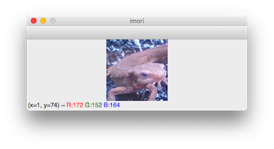

# 画像処理100本ノック!!

English is here  >> https://github.com/KuKuXia/Image_Processing_100_Questions KuKuXia translates into English, so I appreciate his greate effort https://github.com/KuKuXia

画像処理の初学者のための問題１００問が完成しましたぁぁぁぁぁ（＾ｕ＾）私の修論作品です。

これはイモリと一緒に画像処理の基本的処理の知識を身に着け、アルゴリズムを理解するための100本ノックです。ここに載っている問題はOpenCVでAPIが用意されているものが殆どですが、**あえてそれを自分の手で実装**してください。解答も載っけてますが、それはあくまで解答です。自分で考えながら実装して下さい。

- **問題の難易度の順番はめちゃくちゃです。なるべくポピュラーなものを採用していますが、ネタ切れであんまり聞かないものもあります笑**
- **内容はいろいろな文献を調べて載っけてるので正しくないものもあるかもしれないので注意して下さい**
- 【注意】このページを利用して、または関して生じた事に関しては、私は一切責任を負いません。すべて**自己責任**でお願い致します。


## Recent
- 2019.1.29 HSVを修正

## 環境設定

Python-3.6でやって下さい。(解答はPython-3.6で用意してます)

### 1. Minicondaのインストール

https://conda.io/miniconda.html のサイトからMinicondaをインストールします。これはWindowでもMacOSでも可能です。Minicondaがインストールできたら、端末(Windowでは端末、MacOSではターミナル)を開き、以下コマンドで仮想環境を作成します。

```bash
$ conda create python=3.6 -n gasyori100
```

作成できたら、以下コマンドで仮想環境を動作します。

```bash
$ source actiavte gasyori100
```

するとこうなります。

```bash
(gasyori100) :~/work_space/Gasyori100knock/ :$ 
```

### 2. gitのインストール

gitをインストールします。そして、端末を開いて、以下のコマンドを実行します。このコマンドでこのディレクトリを丸ごと自分のパソコンにコピーできます。

```bash
$ git clone https://github.com/yoyoyo-yo/Gasyori100knock.git
```

### 3. パッケージのインストール

以下のコマンドで必要なパッケージをインストールします。


```bash
$ pip install -r requirement.txt
```

### 4. 画像処理チュートリアル

以下のファイルを作成し sample.py という名前で保存し、実行します。

```python
import cv2

img = cv2.imread("assets/imori.jpg")
cv2.imshow("imori", img)
cv2.waitKey(0)
cv2.destroyAllWindows()
```

```bash
$ python sample.py
```

これで以下の画像が表示されれば成功です！
何かボタンを押せば消えます。



次に画像処理に関するnumpyの扱い方のために**Tutorial**フォルダを見てみて下さい。（もう知ってるという人はスキップして下さい。）

あとは問題を解いていってください。それぞれのフォルダに問題内容が入っています。問題では assets/imori.jpg を使用して下さい。各フォルダのREADME.mdに問題、解答プログラムがあります。python answer_@@.py　とすると解答が出ます。

## 問題

詳細な問題内容は各ディレクトリのREADMEにあります。（ディレクトリで下にスクロールすればあります）
- 解答は簡易化のため、main()などは使用しません。
- numpy中心ですが、numpyの基本知識は自分で調べて下さい。

### [チュートリアル](https://github.com/yoyoyo-yo/Gasyori100knock/tree/master/Tutorial)

| | 内容 |
|:---:|:---:|
|1| [画像読み込み・表示](https://github.com/yoyoyo-yo/Gasyori100knock/tree/master/Tutorial#%E7%94%BB%E5%83%8F%E8%AA%AD%E3%81%BF%E8%BE%BC%E3%81%BF%E8%A1%A8%E7%A4%BA) |
|2| [画素をいじる](https://github.com/yoyoyo-yo/Gasyori100knock/tree/master/Tutorial#%E7%94%BB%E7%B4%A0%E3%82%92%E3%81%84%E3%81%98%E3%82%8B) |
|3| [画像のコピー](https://github.com/yoyoyo-yo/Gasyori100knock/tree/master/Tutorial#%E7%94%BB%E5%83%8F%E3%81%AE%E3%82%B3%E3%83%94%E3%83%BC) |
|4| [画像の保存](https://github.com/yoyoyo-yo/Gasyori100knock/tree/master/Tutorial#%E7%94%BB%E5%83%8F%E3%81%AE%E4%BF%9D%E5%AD%98) |
|5| [練習問題](https://github.com/yoyoyo-yo/Gasyori100knock/tree/master/Tutorial#%E7%B7%B4%E7%BF%92)|

### [問題1 - 10](https://github.com/yoyoyo-yo/Gasyori100knock/tree/master/Question_01_10)

|番号|問題||番号|問題|
|:---:|:---:|:---:|:---:|:---:|
|1|[チャネル入れ替え](https://github.com/yoyoyo-yo/Gasyori100knock/tree/master/Question_01_10#q1-%E3%83%81%E3%83%A3%E3%83%8D%E3%83%AB%E5%85%A5%E3%82%8C%E6%9B%BF%E3%81%88)| |6| [減色処理] (https://github.com/yoyoyo-yo/Gasyori100knock/tree/master/Question_01_10#q6-%E6%B8%9B%E8%89%B2%E5%87%A6%E7%90%86) | |
|2|[グレースケール化](https://github.com/yoyoyo-yo/Gasyori100knock/tree/master/Question_01_10#q2-%E3%82%B0%E3%83%AC%E3%83%BC%E3%82%B9%E3%82%B1%E3%83%BC%E3%83%AB%E5%8C%96) | |7| [平均プーリング](https://github.com/yoyoyo-yo/Gasyori100knock/tree/master/Question_01_10#q7-%E5%B9%B3%E5%9D%87%E3%83%97%E3%83%BC%E3%83%AA%E3%83%B3%E3%82%B0) |
|3|[二値化](https://github.com/yoyoyo-yo/Gasyori100knock/tree/master/Question_01_10#q3-%E4%BA%8C%E5%80%A4%E5%8C%96) | |8| [Maxプーリング](https://github.com/yoyoyo-yo/Gasyori100knock/tree/master/Question_01_10#q8-max%E3%83%97%E3%83%BC%E3%83%AA%E3%83%B3%E3%82%B0) | |
|4|[大津の二値化](https://github.com/yoyoyo-yo/Gasyori100knock/tree/master/Question_01_10#q4-%E5%A4%A7%E6%B4%A5%E3%81%AE%E4%BA%8C%E5%80%A4%E5%8C%96) | |9| [ガウシアンフィルタ](https://github.com/yoyoyo-yo/Gasyori100knock/tree/master/Question_01_10#q9-%E3%82%AC%E3%82%A6%E3%82%B7%E3%82%A2%E3%83%B3%E3%83%95%E3%82%A3%E3%83%AB%E3%82%BF) |
|5|[HSV変換](https://github.com/yoyoyo-yo/Gasyori100knock/tree/master/Question_01_10#q5-hsv%E5%A4%89%E6%8F%9B) | |10| [メディアンフィルタ](https://github.com/yoyoyo-yo/Gasyori100knock/tree/master/Question_01_10#q10-%E3%83%A1%E3%83%87%E3%82%A3%E3%82%A2%E3%83%B3%E3%83%95%E3%82%A3%E3%83%AB%E3%82%BF) |

### [問題11 - 20](https://github.com/yoyoyo-yo/Gasyori100knock/tree/master/Question_11_20)

|番号|問題||番号|問題|
|:---:|:---:|:---:|:---:|:---:|
|11| [平滑化フィルタ](https://github.com/yoyoyo-yo/Gasyori100knock/tree/master/Question_11_20#q11-%E5%B9%B3%E6%BB%91%E5%8C%96%E3%83%95%E3%82%A3%E3%83%AB%E3%82%BF) | |16| [Prewittフィルタ](https://github.com/yoyoyo-yo/Gasyori100knock/tree/master/Question_11_20#q16-prewitt%E3%83%95%E3%82%A3%E3%83%AB%E3%82%BF) | 
|12| [モーションフィルタ](https://github.com/yoyoyo-yo/Gasyori100knock/tree/master/Question_11_20#q12-%E3%83%A2%E3%83%BC%E3%82%B7%E3%83%A7%E3%83%B3%E3%83%95%E3%82%A3%E3%83%AB%E3%82%BF) | |17| [Laplacianフィルタ](https://github.com/yoyoyo-yo/Gasyori100knock/tree/master/Question_11_20#q17-laplacian%E3%83%95%E3%82%A3%E3%83%AB%E3%82%BF) |
|13| [MAX-MINフィルタ](https://github.com/yoyoyo-yo/Gasyori100knock/tree/master/Question_11_20#q13-max-min%E3%83%95%E3%82%A3%E3%83%AB%E3%82%BF) | |18| [Embossフィルタ](https://github.com/yoyoyo-yo/Gasyori100knock/tree/master/Question_11_20#q18-emboss%E3%83%95%E3%82%A3%E3%83%AB%E3%82%BF) |
|14| [微分フィルタ](https://github.com/yoyoyo-yo/Gasyori100knock/tree/master/Question_11_20#q14-%E5%BE%AE%E5%88%86%E3%83%95%E3%82%A3%E3%83%AB%E3%82%BF) | |19| [LoGフィルタ](https://github.com/yoyoyo-yo/Gasyori100knock/tree/master/Question_11_20#q19-log%E3%83%95%E3%82%A3%E3%83%AB%E3%82%BF) | 
|15| [Sobelフィルタ](https://github.com/yoyoyo-yo/Gasyori100knock/tree/master/Question_11_20#q15-sobel%E3%83%95%E3%82%A3%E3%83%AB%E3%82%BF) | |20| [ヒストグラム表示](https://github.com/yoyoyo-yo/Gasyori100knock/tree/master/Question_11_20#q20-%E3%83%92%E3%82%B9%E3%83%88%E3%82%B0%E3%83%A9%E3%83%A0%E8%A1%A8%E7%A4%BA)  | 

### [問題21 - 30](https://github.com/yoyoyo-yo/Gasyori100knock/tree/master/Question_21_30)

|番号|問題||番号|問題|
|:---:|:---:|:---:|:---:|:---:|
|21| [ヒストグラム正規化](https://github.com/yoyoyo-yo/Gasyori100knock/tree/master/Question_21_30#q21-%E3%83%92%E3%82%B9%E3%83%88%E3%82%B0%E3%83%A9%E3%83%A0%E6%AD%A3%E8%A6%8F%E5%8C%96) | |26| [Bi-linear補間](https://github.com/yoyoyo-yo/Gasyori100knock/tree/master/Question_21_30#q26-bi-linear%E8%A3%9C%E9%96%93) |
|22| [ヒストグラム操作](https://github.com/yoyoyo-yo/Gasyori100knock/tree/master/Question_21_30#q22-%E3%83%92%E3%82%B9%E3%83%88%E3%82%B0%E3%83%A9%E3%83%A0%E6%93%8D%E4%BD%9C) | |27| [Bi-cubic補間](https://github.com/yoyoyo-yo/Gasyori100knock/tree/master/Question_21_30#q27-bi-cubic%E8%A3%9C%E9%96%93) |
| 23| [ヒストグラム平坦化](https://github.com/yoyoyo-yo/Gasyori100knock/tree/master/Question_21_30#q23-%E3%83%92%E3%82%B9%E3%83%88%E3%82%B0%E3%83%A9%E3%83%A0%E5%B9%B3%E5%9D%A6%E5%8C%96) | |28| [アフィン変換(平行移動)](https://github.com/yoyoyo-yo/Gasyori100knock/tree/master/Question_21_30#q28-%E3%82%A2%E3%83%95%E3%82%A3%E3%83%B3%E5%A4%89%E6%8F%9B%E5%B9%B3%E8%A1%8C%E7%A7%BB%E5%8B%95) |
| 24| [ガンマ補正](https://github.com/yoyoyo-yo/Gasyori100knock/tree/master/Question_21_30#q24-%E3%82%AC%E3%83%B3%E3%83%9E%E8%A3%9C%E6%AD%A3) | |29| [アフィン変換(拡大縮小)](https://github.com/yoyoyo-yo/Gasyori100knock/tree/master/Question_21_30#q29-%E3%82%A2%E3%83%95%E3%82%A3%E3%83%B3%E5%A4%89%E6%8F%9B%E6%8B%A1%E5%A4%A7%E7%B8%AE%E5%B0%8F) |
|25| [最近傍補間](https://github.com/yoyoyo-yo/Gasyori100knock/tree/master/Question_21_30#q25-%E6%9C%80%E8%BF%91%E5%82%8D%E8%A3%9C%E9%96%93) | |30| [アフィン変換(回転)](https://github.com/yoyoyo-yo/Gasyori100knock/tree/master/Question_21_30#q30-%E3%82%A2%E3%83%95%E3%82%A3%E3%83%B3%E5%A4%89%E6%8F%9B%E5%9B%9E%E8%BB%A2) |

### [問題31 - 40](https://github.com/yoyoyo-yo/Gasyori100knock/tree/master/Question_31_40)

|番号|問題||番号|問題|
|:---:|:---:|:---:|:---:|:---:|
|31|アフィン変換(スキュー)| | 36| JPEG圧縮 (Step.1)離散コサイン変換 |
|32|フーリエ変換 | |37| PSNR|
|33|フーリエ変換 ローパスフィルタ| |38| JPEG圧縮 (Step.2)DCT+量子化|
|34|フーリエ変換 ハイパスフィルタ| |39| JPEG圧縮 (Step.3)YCbCr表色系|
|35|フーリエ変換 バンドパスフィルタ| | 40| JPEG圧縮 (Step.4)YCbCr+DCT+量子化 |

### [問題41 - 50](https://github.com/yoyoyo-yo/Gasyori100knock/tree/master/Question_41_50)

|番号|問題||番号|問題|
|:---:|:---:|:---:|:---:|:---:|
| 41 | Cannyエッジ検出 (Step.1) エッジ強度 | | 46| Hough変換・直線検出 (Step.3) Hough逆変換 |
| 42 | Cannyエッジ検出 (Step.2) 細線化 | | 47 |モルフォロジー処理(膨張) |
| 43 | Cannyエッジ検出 (Step.3) ヒステリシス閾処理 | | 48 |モルフォロジー処理(収縮) |
| 44| Hough変換・直線検出 (Step.1) Hough変換 | | 49 |オープニング処理 |
| 45| Hough変換・直線検出 (Step.2) NMS | | 50 |クロージング処理 |

### [問題51 - 60](https://github.com/yoyoyo-yo/Gasyori100knock/tree/master/Question_51_60)

|番号|問題||番号|問題|
|:---:|:---:|:---:|:---:|:---:|
| 51 |モルフォロジー勾配 | | 56 |テンプレートマッチング NCC |
| 52 |トップハット変換 | | 57 |テンプレートマッチング ZNCC |
| 53 |ブラックハット変換 | | 58 |ラベリング 4近傍 |
| 54 |テンプレートマッチング SSD | | 59 |ラベリング 8近傍 |
| 55 |テンプレートマッチング SAD | | 60 |アルファブレンド |

### [問題61 - 70](https://github.com/yoyoyo-yo/Gasyori100knock/tree/master/Question_61_70)

|番号|問題||番号|問題|
|:---:|:---:|:---:|:---:|:---:|
| 61 | 4-連結数 | | 66 | HOG (Step.1) 勾配強度・勾配角度
| 62 | 8-連結数 | | 67 | HOG (Step.2) 勾配ヒストグラム
| 63 | 細線化 | | 68 | HOG (Step.3) ヒストグラム正規化
| 64**未** | ヒルディッチの細線化 | | 69 | HOG (Step.4) 特徴量の描画
| 65 | Zhang-Suenの細線化 || 70 | カラートラッキング

### [問題71 - 80](https://github.com/yoyoyo-yo/Gasyori100knock/tree/master/Question_71_80)

|番号|問題||番号|問題|
|:---:|:---:|:---:|:---:|:---:|
| 71 | マスキング | | 76 | 顕著性マップ
| 72 | マスキング(カラートラッキングとモルフォロジー) | | 77 | ガボールフィルタ
| 73 | 縮小と拡大 | | 78 | ガボールフィルタの回転
| 74 | ピラミッド差分による高周波成分の抽出 | | 79 | ガボールフィルタによるエッジ抽出
| 75 | ガウシアンピラミッド | | 80 | ガボールフィルタによる特徴抽出

### [問題81 - 90](https://github.com/yoyoyo-yo/Gasyori100knock/tree/master/Question_81_90)

|番号|問題||番号|問題|
|:---:|:---:|:---:|:---:|:---:|
| 81 | Hessianのコーナー検出 | | 86 | 簡単な画像認識 (Step.3) 評価(Accuracy) |
| 82 | Harrisのコーナー検出 (Step.1) Sobel + Gaussian | | 87 | 簡単な画像認識 (Step.4) k-NN |
| 83 | Harrisのコーナー検出 (Step.2) コーナー検出 | | 88 | K-means (Step.1) 重心作成 |
| 84 | 簡単な画像認識 (Step.1) 減色化 + ヒストグラム | | 89 | K-means (Step.2) クラスタリング |
| 85 | 簡単な画像認識 (Step.2) クラス判別 | | 90 | K-means (Step.3) 初期ラベルの変更 |

### [問題91 - 100](https://github.com/yoyoyo-yo/Gasyori100knock/tree/master/Question_91_100)

|番号|問題||番号|問題|
|:---:|:---:|:---:|:---:|:---:|
| 91 | K-meansによる減色処理 (Step.1) 色の距離によるクラス分類 | | 96 | ニューラルネットワーク (Step.2) 学習
| 92 | K-meansによる減色処理 (Step.2) 減色処理 | | 97 | 簡単な物体検出 (Step.1) スライディングウィンドウ + HOG
| 93 | 機械学習の学習データの用意 (Step.1) IoUの計算 | | 98 | 簡単な物体検出 (Step.2) スライディングウィンドウ + NN
| 94 | 機械学習の学習データの用意 (Step.2) ランダムクラッピング | | 99 | 簡単な物体検出 (Step.3) Non-Maximum Suppression
| 95 | ニューラルネットワーク (Step.1) ディープラーニングにする | | 100 | 簡単な物体検出 (Step.4) 評価 Precision, Recall, F-score, mAP


## TODO

adaptivebinalizatino, poison image blending

