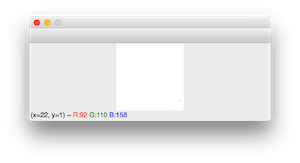
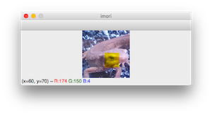
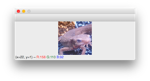

# Tutorial

C++でやりたい人はこっち〜〜 >> https://github.com/yoyoyo-yo/Gasyori100knock/blob/master/Tutorial/README_opencv_c_install.md

ここでは画像処理におけるnumpyの基本的な使い方をいくつか紹介していきます。

**numpy**とはpyhtonで用意されたパッケージ(Cでいうライブラリのようなもの)の一種で、行列演算などを得意としています。

また、画像処理では**OpenCV**というライブラリがあり、様々な処理をAPIかしています。

この問題では、numpyをいじって、OpenCVの処理を自分の手で実現することを目標としています。

pythonでのOpenCVはnumpyをベースとしているため、numpyがいじれる=OpenCVもいじれる　ということになっていきます。


ここからはpyファイルでなく、インタプリタ形式でやってみて下さい。


## Python起動

コマンドプロンプト上で「python」と打って下さい。
すると、こんな感じで >>> と出るはずです。

```bash
(gasyori100) :~/work_space/Gasyori100knock/Tutorial :$ python
Python 3.6.7 |Anaconda, Inc.| (default, Oct 23 2018, 14:01:38) 
[GCC 4.2.1 Compatible Clang 4.0.1 (tags/RELEASE_401/final)] on darwin
Type "help", "copyright", "credits" or "license" for more information.
>>> 
```
## インポート

ここから、パッケージをインストールしていきます。
OpenCVはcv2、numpyはnumpyをそれぞれインポートします。
（numpyはよくnpという名前にエイリアスします。）

```bash
>>> import cv2
>>> import numpy as np
```

## 画像読み込み、表示

画像を読み込むのはimread()です。
*imori.jpg*を読み込むには、こうします。

```bash
>>> img = cv2.imread("imori.jpg")
```

これで変数imgに画像情報がnumpy形式で保存されます。

画像のサイズ情報をとるにはimg.shapeを使います。
これは(高さ、横、チャネル)の順になっていて、つまり 縦128ピクセル、横128ピクセル、3チャネル(青、緑、赤)を意味します。

```bash
>>> img.shape
(128, 128, 3)
>>>
```

型をとるには、img.dtypeを使用します。
uint8とは符号なしintで8ビットを意味します。画像はRGB成分がそれぞれ通常0から255の256段階で表現されます。
例えば、赤のピクセルは(R,G,B) = (255, 0, 0)、白は(R,G,B) = (255, 255, 255)です。
画像にする時は必ずこの型にしないと画像がおかしくなってしまいます。（あとで説明します。）

```bash
>>> img.dtype
dtype('uint8')
>>>
```

画像の表示はcv2.imshow()を使います。
cv2.imshow()の第一引数にはウィンドウの名前（特に気にしなくて良い）、第二引数には画像が必要です。

cv2.waitKey(0)はキーボードから何かが入力されるまで画像を表示する、という働きがあります。（もっと気になる人は自分で調べて）

```bash
>>> cv2.imshow('', img); cv2.waitKey(0)
102
>>> 
```

|表示 (assets/sample1.png)|
|:---:|
||


例えば、imgの型をfloat32にしてみます。
これはastype()を使えばできます。

```bash
>>> _img = img.astype(np.float32)
```

これを表示すると、こうなります。
つまり型がおかしくなるために表示がおかしくなります。（ただし保存はできます。）
なので、画像をいじる時は、
1. cv2.imreadで読み込む
2. 型を**一度np.float32など小数点型に変換する**
3. 画像をいじる
4. **画素が0未満のものは0, 255を超えたものは255に直す。**（超重要）
5. 型を**np.uint8に変換して表示・保存する**
この手順にすることをおすすめします。

4に関しては次章の「画素をいじる」で紹介します。

```bash
>>> cv2.imshow('', _img); cv2.waitKey(0)
102
>>>
```
|表示 (assets/sample2.png)|
|:---:|
||

## 画素をいじる。

画像の操作法はnumpyとほとんど同じです。

例えば、x=30、y=20の画素値をいじりたい時は、こうします。
画素値はBGRの順に並んでいます。array()とはnumpy形式になっていることを意味します。つまり、OpenCVはnumpyのラッパーです。

```bash
>>> img[20, 30]
array([232, 178, 171], dtype=uint8)
>>> 
```

さらに、x=30、y=20、のG成分をとる時はこうします。

```bash
>>> img[20, 30, 1]
178
>>> 
```

ここから、numpyの本題に入っていきます。

numpyには**スライス**という機能があります。
これはある値v1からある値v2までの全ての要素にアクセスできることを意味します。

例えば、y=20, x=[30, 32]までを見る時はこうします。
30:33とすれば行列のまま取り出せます。a:bとすることで、a<= v < bの値にアクセスできます。
ちなみに :30とすれば [0, 30]、30:とすれば[30, 最後]までを取り出せます。

```bash
>>> img[20, 30:33]
array([[232, 178, 171],
[209, 156, 153],
[134,  85,  77]], dtype=uint8)
>>> 
```

例えば画像の左上(x=[0, 50], y = [0, 50])を黒にするには、こんな感じでできます。
copy()については次で説明します。

```bash
>>> img2 = img.copy()
>>> img2[:50, :50] = 0
>>> cv2.imshow("", img2); cv2.waitKey(0)
0
>>>
```

|表示 (assets/sample3.png)|
|:---:|
||


次に先程の　4. **画素が0未満のものは0, 255を超えたものは255に直す。**　に関して説明します。

例えば、画像を一度 float32型にして、一部分のB成分を260という値に変えてみます。
uint8型は[0, 255] の範囲しか取り得ないので、これをuint8型に直すとこんな風になります。
イモリの顔の一部分が黄色くなってしまっています。

**これは、260をuint8型に直すと260 - 256 が起きて、B=4となってしまうためです。**
これが原因で画素値がおかしくなることが多々起きてしまいます。
なので、4の操作が必要となります。

```bash
>>> img2 = img.copy().astype(np.float32)
>>> img2[60:100, 60:100, 0] = 260
>>> cv2.imshow("imori", img2.astype(np.uint8)); cv2.waitKey(0)
```

|表示 (assets/sample5.png)|
|:---:|
||

## 画像のコピー

画像を別変数にコピーしたい時はcopy()を使いましょう。

```bash
>>> img2 = img.copy()
```

単純に img2 = img とすると、画像のアドレスが保存されるのでimg2をいじるとimgにも反映されてしまします。

特別な利用がない場合は、**copy()で画像をコピーしましょう**。

## 画像の保存

保存には cv2.imwrite()を使いましょう。

例えば先程のimg2を *sample.jpg* という名前で保存する時はこうしましょう。
Trueとなれば保存に成功で、これで同じフォルダ内にsample.jpgというファイルができています。

```bash
>>> cv2.imwrite("sample.jpg", img2)
True
>>>
```

## 練習

画像の左半分上のRとBを入れ替えて表示してみましょう。

回答例
 
```bash
>>> import cv2
>>> img = cv2.imread("imori.jpg")
>>> img3 = img.copy()
>>> H, W, C = img3.shape
>>> img3[:H//2, :W//2] = img3[:H//2, :W//2, (2, 1, 0)]
>>> cv2.imshow('', img3); cv2.waitKey(0)
102
>>> 
```

|表示 (assets/sample4.png)|
|:---:|
||

以上でチュートリアルは終了です。

あとはばんばん問題を解いて下さい！！！！
